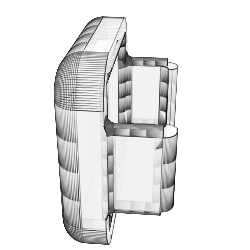
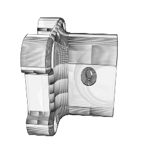

# Backcountry Beacon: 3D Parts

This repository contains all the 3D parts for the Backcountry Beacon project.  
Always make sure to pull the latest before starting a new build.  

## GPS Holder - Top

This part securely holds the top section of the BZ-181 GPS module in place on the T-Dongle S3. It's designed to snugly fit around the module while providing easy access to necessary ports. **Filename:** <a href="./GpsHolder-Top.stl">GpsHolder-Top.stl</a> **Drawn By:** Brett Smith

   
## GPS Holder - Bottom

This part serves as the base for the BZ-181 GPS module, mounting it firmly to the T-Dongle S3. It aligns perfectly with the top holder to provide a stable and fit for the GPS module onto the TDongle. **Filename:** <a href="./GpsHolder-Bottom.stl">GpsHolder-Bottom.stl</a> **Drawn By:** Brett Smith

   
